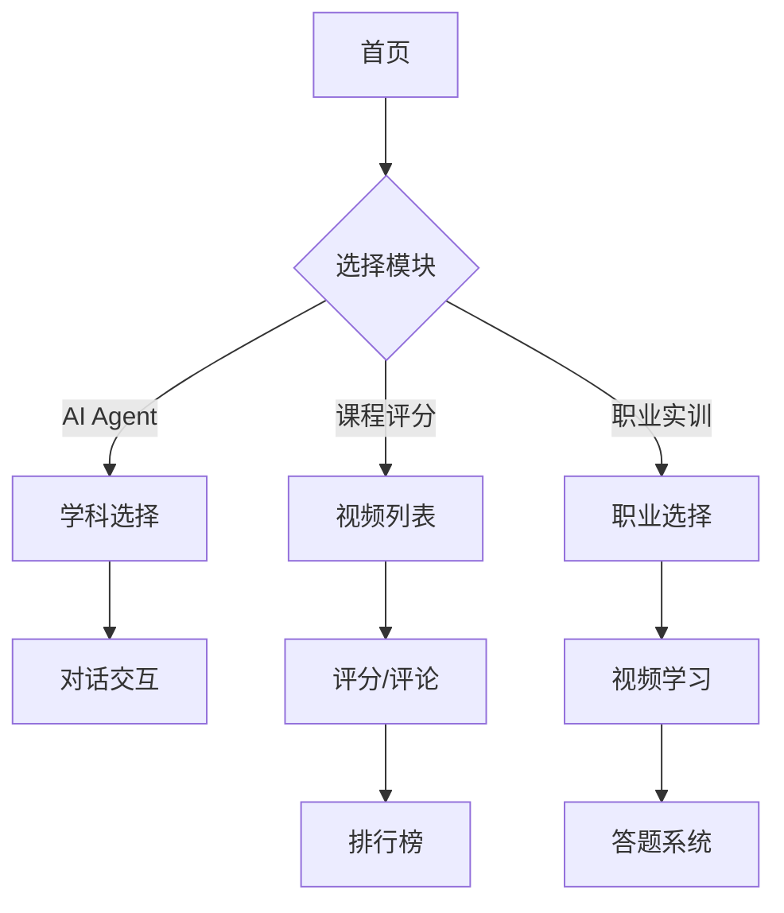

## 1. Product Overview
智慧教学与学习平台，面向高校学生提供多学科AI辅助学习、课程评分和职业技能实训服务，助力学生提升学习效率和职业竞争力。
- 主要目的：提供AI驱动的个性化学习体验，促进教学质量反馈，培养职业核心技能
- 目标用户：高校学生、教师
- 市场价值：通过AI技术赋能教育，实现个性化学习和教学质量持续改进

## 2. Core Features

### 2.1 User Roles
| Role | Registration Method | Core Permissions |
|------|---------------------|------------------|
| Normal User | Email registration | Browse courses, use AI Agent, submit ratings, take training |
| Admin | System invitation | Manage courses, view statistics, moderate content |

### 2.2 Feature Module
1. **AI Agent 页面**: 多学科AI助手，支持学科选择和对话交互
2. **课程评分页面**: 流动性评分系统，支持视频评分和评论
3. **职业实训页面**: 职业导向学习模块，视频学习和答题系统

### 2.3 Page Details
| Page Name | Module Name | Feature description |
|-----------|-------------|---------------------|
| AI Agent | 学科选择 | 用户可选择不同学科的专属AI Agent |
| AI Agent | 对话界面 | 与AI Agent进行实时对话，获取学习指导 |
| 课程评分 | 视频列表 | 展示教学视频，支持点击跳转外部链接 |
| 课程评分 | 评分系统 | 星级评分、点赞、评论、纠错功能 |
| 课程评分 | 排行榜 | 动态展示热门课程和评分排名 |
| 职业实训 | 职业选择 | 用户选择感兴趣的职业方向 |
| 职业实训 | 视频学习 | 播放教学视频，支持进度追踪 |
| 职业实训 | 答题系统 | 视频结束后进行测验，类似慕课模式 |

## 3. Core Process

### AI Agent 使用流程
用户进入AI Agent页面 → 选择学科 → 与AI对话 → 获取学习建议

### 课程评分流程
用户浏览视频列表 → 点击视频查看详情 → 进行星级评分 → 发表评论/点赞/纠错 → 查看排行榜

### 职业实训流程
用户选择职业方向 → 选择课程 → 观看教学视频 → 完成视频后进行答题 → 查看成绩

## 4. User Interface Design

### 4.1 Design Style
- **主色调**: 莫兰迪色系（柔和的灰粉色、灰蓝色、灰绿色、灰黄色）
- **辅助色**: 低饱和度的珊瑚色作为强调色
- **按钮风格**: 圆角矩形，柔和阴影，悬停时轻微放大
- **字体**: 标题使用圆润优雅的字体，正文使用清晰易读的字体
- **布局风格**: 卡片式布局，大量留白，层次分明
- **图标风格**: 线性图标，柔和线条

### 4.2 Page Design Overview
| Page Name | Module Name | UI Elements |
|-----------|-------------|-------------|
| AI Agent | 学科选择 | 圆形学科图标，悬停动画，柔和背景渐变 |
| AI Agent | 对话界面 | 气泡式消息，输入框带圆角，发送按钮渐变 |
| 课程评分 | 视频列表 | 卡片式展示，封面图+标题+评分，hover效果 |
| 课程评分 | 评分系统 | 星级组件，评论区，纠错按钮 |
| 课程评分 | 排行榜 | 排名列表，进度条展示评分 |
| 职业实训 | 职业选择 | 网格布局职业卡片，图标+描述 |
| 职业实训 | 视频学习 | 视频播放器占位，进度条，播放控制 |
| 职业实训 | 答题系统 | 选择题展示，选项卡片，提交按钮 |

### 4.3 Responsiveness
- 桌面优先设计，支持响应式布局
- 移动端：单列布局，导航栏折叠为汉堡菜单
- 平板：两列布局，保持良好的可读性

### 4.4 3D Scene Guidance
- 不适用本项目
