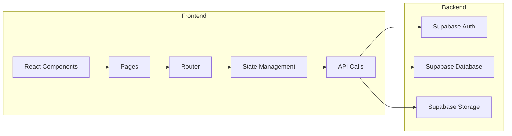
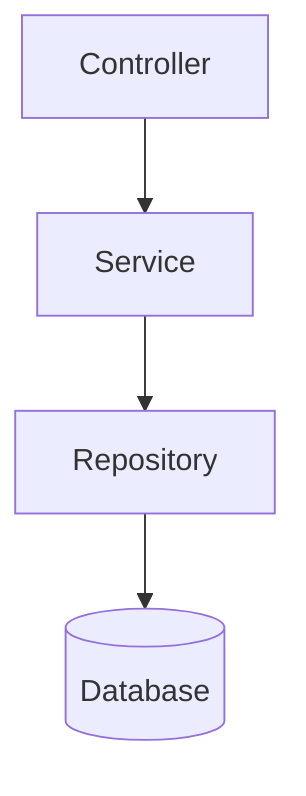
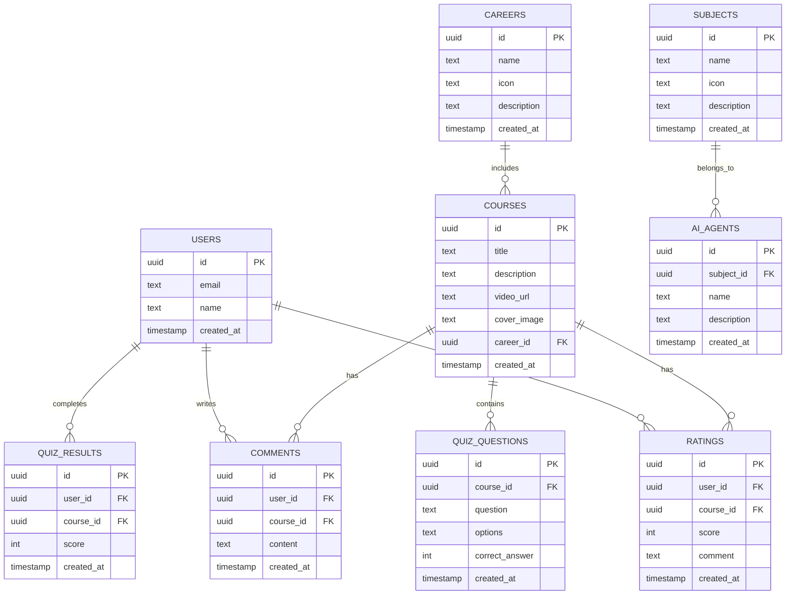

## 1. Architecture Design


## 2. Technology Description
- Frontend: React@18 + TypeScript + tailwindcss@3 + vite@6
- Initialization Tool: vite-init
- Backend: Supabase
- Database: Supabase (PostgreSQL)
- Icons: lucide-react
- State Management: zustand

## 3. Route Definitions
| Route | Purpose |
|-------|---------|
| / | 首页，展示三个模块入口 |
| /agent | AI Agent页面，学科选择和对话 |
| /rating | 课程评分页面，视频评分系统 |
| /training | 职业实训页面，视频学习和答题 |

## 4. API Definitions

### 4.1 AI Agent API
- POST /api/agent/chat - 与AI Agent对话
- GET /api/agent/subjects - 获取学科列表

### 4.2 Course Rating API
- GET /api/courses - 获取课程列表
- POST /api/ratings - 提交评分
- GET /api/ratings/:courseId - 获取课程评分
- POST /api/comments - 提交评论
- GET /api/rankings - 获取排行榜

### 4.3 Training API
- GET /api/careers - 获取职业列表
- GET /api/courses/:careerId - 获取职业相关课程
- POST /api/quiz/submit - 提交答题结果
- GET /api/quiz/:courseId - 获取课程测验

## 5. Server Architecture Diagram


## 6. Data Model

### 6.1 Data Model Definition


### 6.2 Data Definition Language

```sql
CREATE TABLE users (
    id UUID PRIMARY KEY DEFAULT uuid_generate_v4(),
    email TEXT UNIQUE NOT NULL,
    name TEXT NOT NULL,
    created_at TIMESTAMP DEFAULT CURRENT_TIMESTAMP
);

CREATE TABLE subjects (
    id UUID PRIMARY KEY DEFAULT uuid_generate_v4(),
    name TEXT NOT NULL,
    icon TEXT,
    description TEXT,
    created_at TIMESTAMP DEFAULT CURRENT_TIMESTAMP
);

CREATE TABLE ai_agents (
    id UUID PRIMARY KEY DEFAULT uuid_generate_v4(),
    subject_id UUID REFERENCES subjects(id),
    name TEXT NOT NULL,
    description TEXT,
    created_at TIMESTAMP DEFAULT CURRENT_TIMESTAMP
);

CREATE TABLE careers (
    id UUID PRIMARY KEY DEFAULT uuid_generate_v4(),
    name TEXT NOT NULL,
    icon TEXT,
    description TEXT,
    created_at TIMESTAMP DEFAULT CURRENT_TIMESTAMP
);

CREATE TABLE courses (
    id UUID PRIMARY KEY DEFAULT uuid_generate_v4(),
    title TEXT NOT NULL,
    description TEXT,
    video_url TEXT,
    cover_image TEXT,
    career_id UUID REFERENCES careers(id),
    created_at TIMESTAMP DEFAULT CURRENT_TIMESTAMP
);

CREATE TABLE ratings (
    id UUID PRIMARY KEY DEFAULT uuid_generate_v4(),
    user_id UUID REFERENCES users(id),
    course_id UUID REFERENCES courses(id),
    score INT NOT NULL CHECK (score >= 1 AND score <= 5),
    comment TEXT,
    created_at TIMESTAMP DEFAULT CURRENT_TIMESTAMP
);

CREATE TABLE comments (
    id UUID PRIMARY KEY DEFAULT uuid_generate_v4(),
    user_id UUID REFERENCES users(id),
    course_id UUID REFERENCES courses(id),
    content TEXT NOT NULL,
    created_at TIMESTAMP DEFAULT CURRENT_TIMESTAMP
);

CREATE TABLE quiz_questions (
    id UUID PRIMARY KEY DEFAULT uuid_generate_v4(),
    course_id UUID REFERENCES courses(id),
    question TEXT NOT NULL,
    options TEXT NOT NULL,
    correct_answer INT NOT NULL,
    created_at TIMESTAMP DEFAULT CURRENT_TIMESTAMP
);

CREATE TABLE quiz_results (
    id UUID PRIMARY KEY DEFAULT uuid_generate_v4(),
    user_id UUID REFERENCES users(id),
    course_id UUID REFERENCES courses(id),
    score INT NOT NULL,
    created_at TIMESTAMP DEFAULT CURRENT_TIMESTAMP
);
```

### 6.3 Initial Data

```sql
INSERT INTO subjects (name, icon, description) VALUES
('计算机科学', 'cpu', '人工智能、编程、数据科学'),
('数学', 'calculator', '代数、几何、微积分'),
('物理', 'atom', '力学、电磁学、量子物理'),
('化学', 'flask-conical', '有机化学、无机化学、分析化学'),
('生物', 'dna', '分子生物学、遗传学、生态学'),
('经济学', 'trending-up', '宏观经济、微观经济、金融学'),
('管理学', 'briefcase', '市场营销、人力资源、运营管理'),
('设计', 'palette', '平面设计、UI设计、工业设计');

INSERT INTO careers (name, icon, description) VALUES
('软件工程师', 'code', '从事软件开发、系统架构设计'),
('数据分析师', 'bar-chart-2', '数据分析、数据可视化、商业智能'),
('产品经理', 'layout', '产品设计、需求分析、项目管理'),
('UI/UX设计师', 'pen-tool', '用户界面设计、用户体验优化'),
('人工智能工程师', 'brain', '机器学习、深度学习、NLP'),
('金融分析师', 'line-chart', '投资分析、风险评估、财务建模');

INSERT INTO courses (title, description, video_url, cover_image, career_id) VALUES
('Python基础入门', '从零开始学习Python编程语言', 'https://example.com/video1', 'python.jpg', (SELECT id FROM careers WHERE name = '软件工程师')),
('机器学习入门', '学习机器学习基础知识和算法', 'https://example.com/video2', 'ml.jpg', (SELECT id FROM careers WHERE name = '人工智能工程师')),
('数据可视化实战', '使用Python进行数据可视化', 'https://example.com/video3', 'viz.jpg', (SELECT id FROM careers WHERE name = '数据分析师')),
('产品设计方法论', '学习产品设计的核心方法', 'https://example.com/video4', 'product.jpg', (SELECT id FROM careers WHERE name = '产品经理')),
('UI设计原理', '用户界面设计的基本原则', 'https://example.com/video5', 'ui.jpg', (SELECT id FROM careers WHERE name = 'UI/UX设计师'));

INSERT INTO quiz_questions (course_id, question, options, correct_answer) VALUES
((SELECT id FROM courses WHERE title = 'Python基础入门'), 'Python中如何定义一个函数？', 'def func():|function func():|func = function():|def func[]:', 0),
((SELECT id FROM courses WHERE title = 'Python基础入门'), 'Python中的列表用什么符号表示？', '{|[]|()|<>:', 1),
((SELECT id FROM courses WHERE title = '机器学习入门'), '以下哪个不是监督学习算法？', '线性回归|决策树|K-means|支持向量机', 2);
```
